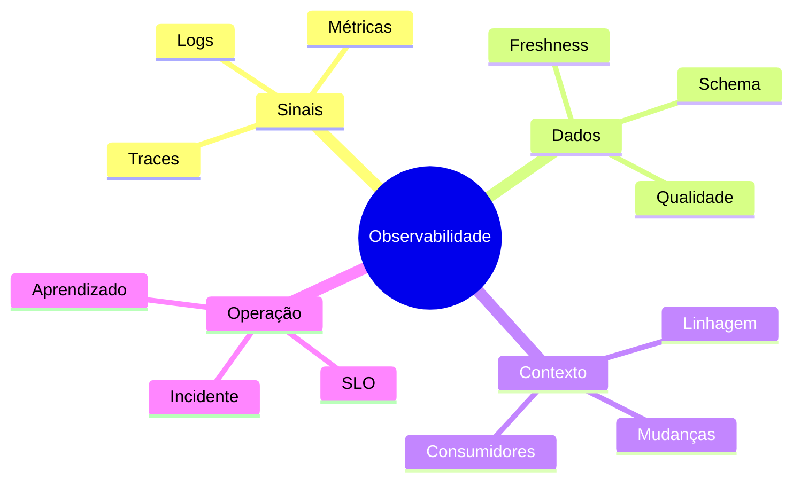

# Resumo

- Monitoramento verifica condições conhecidas; observabilidade apoia perguntas novas.
- Telemetria precisa de contexto e qualidade para ser útil.
- Logs registram eventos, métricas agregam e traces mostram caminhos causais.
- Cardinalidade, retenção e volume influenciam custo.
- Saúde técnica e saúde dos dados podem divergir.
- Freshness, volume, schema, distribuição e qualidade complementam execução.
- Linhagem permite buscar causas upstream e impacto downstream.
- SLIs representam experiência; SLOs definem metas em janelas.
- Alertas devem indicar impacto e ação.
- Runbooks aceleram resposta; postmortems fortalecem o sistema.
- Telemetria exige controles de segurança e privacidade.
- Maturidade aparece na redução de tempo, impacto e recorrência.

Teste sua compreensão em [[12-Perguntas-de-Entrevista]] e [[13-Exercicios]].
