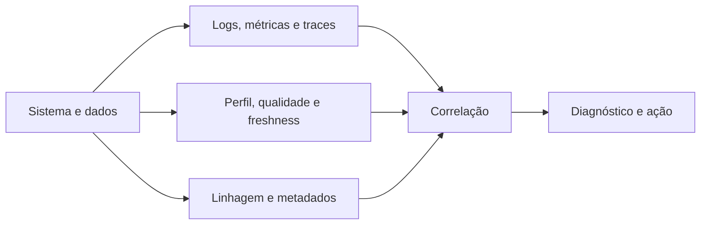

# Módulo 11 — Observabilidade de Dados

> [!abstract]
> Observabilidade é a capacidade de explicar o estado interno de um sistema por suas evidências externas. Em dados, ela conecta execução, conteúdo, linhagem e impacto ao consumidor.

## Estrutura

- [[01-Objetivos]]
- [[02-Introducao]]
- [[03-O-que-e-Observabilidade-de-Dados]]
- [[04-Logs-Metricas-Traces-e-Correlacao]]
- [[05-Saude-Operacional-e-Observabilidade-dos-Dados]]
- [[06-Linhagem-Dependencias-e-Analise-de-Impacto]]
- [[07-SLIs-SLOs-Alertas-e-Dashboards]]
- [[08-Incidentes-Runbooks-e-Postmortems]]
- [[09-Arquitetura-Custo-Seguranca-e-Maturidade]]
- [[10-Estudo-de-Caso-DataRetail]]
- [[11-Resumo]]
- [[12-Perguntas-de-Entrevista]]
- [[13-Exercicios]]
- [[13-Gabarito]]
- [[14-Laboratorio]]
- [[14-Solucao]]
- [[15-Referencias]]

## Projeto integrador

A DataRetail S.A. correlacionará spans, métricas e SLOs de um pipeline para detectar e registrar um incidente sem duplicação.
