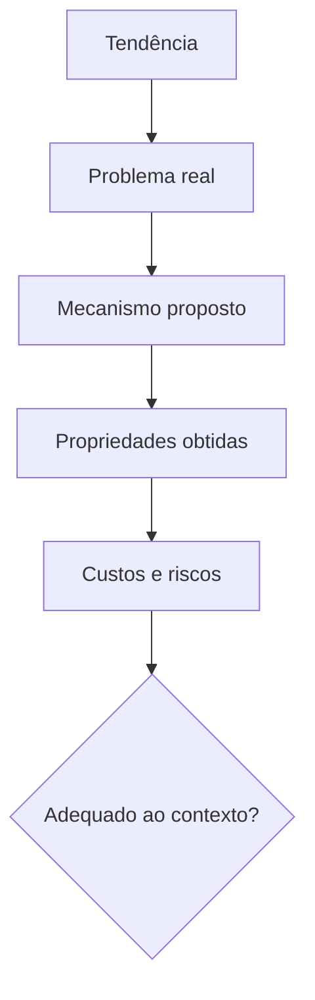

# Introdução

O setor de dados cria novos termos rapidamente. Alguns nomeiam mudanças importantes; outros reembalam práticas conhecidas. Uma avaliação responsável separa problema, mecanismo, propriedade e custo antes de comparar produtos.

“Moderno” não significa universalmente melhor. Serviços gerenciados reduzem operação local, mas podem aumentar dependência e custo variável. Descentralização aproxima o domínio, mas exige plataforma e contratos. Tempo real reduz latência, mas eleva complexidade de estado.

Este módulo fecha o Volume 01 ao recombinar arquitetura, pipelines, qualidade, governança e observabilidade em modelos operacionais contemporâneos.

> [!warning]
> Adotar arquitetura organizacional sem mudar ownership e incentivos produz apenas nova nomenclatura sobre o mesmo gargalo.

Comece pela leitura crítica em [[03-O-que-sao-Conceitos-Modernos-em-Dados]].
