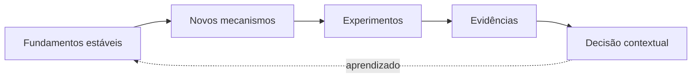

# O que são Conceitos Modernos em Dados

Conceitos modernos são respostas recentes a mudanças de escala, nuvem, diversidade de consumidores e necessidade de autonomia. Muitos combinam armazenamento desacoplado, computação elástica, interfaces declarativas, automação e serviços gerenciados.

## Lentes de avaliação

| Lente | Pergunta |
|---|---|
| Problema | qual limitação concreta é resolvida? |
| Mecanismo | como a solução produz a propriedade? |
| Operação | quem mantém estado, falhas e upgrades? |
| Economia | qual unidade dirige o custo? |
| Portabilidade | quais dados e contratos podem migrar? |
| Organização | quais papéis e incentivos precisam mudar? |

## Sinais de hype

Promessa universal, ausência de trade-offs, benchmark sem contexto, arquitetura definida por logos e equivalência entre compra e capacidade organizacional. Um conceito sólido admite limites e critérios de não adoção.

> [!note]
> Nomes mudam mais rápido que problemas de consistência, estado, contratos, custo e responsabilidade.

Uma das mudanças centrais é descrita em [[04-Produtos-de-Dados-e-Contratos]].
