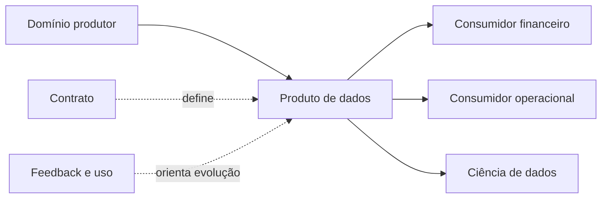

# Produtos de Dados e Contratos

Produto de dados é uma oferta mantida para consumidores identificados, com propósito, interface, owner, documentação, qualidade, SLO, segurança e suporte. Uma tabela só se torna produto quando existe compromisso de uso e ciclo de vida.

## Características

- descobrível e compreensível;
- endereçável por interface estável;
- confiável e observável;
- seguro e governado;
- interoperável por contratos;
- mantido por owner responsável.

```yaml
produto: pedidos_confiaveis
owner: dominio_pedidos
consumidores: [financeiro, logistica]
schema_version: 3
slo_freshness_minutos: 5
classificacao: confidencial
```

Contratos cobrem estrutura, semântica, operação e evolução. Consumer-driven contracts ajudam a revelar dependências reais, mas o produtor ainda precisa preservar coerência do domínio.



> [!tip]
> Meça sucesso por adoção, resultado e confiabilidade, não pelo número de produtos publicados.

Produtos escaláveis dependem de [[05-Arquitetura-Evolutiva-e-Plataformas-Self-Service]].
