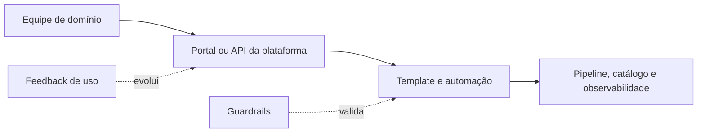

# Arquitetura Evolutiva e Plataformas Self-Service

Uma plataforma de dados oferece capacidades reutilizáveis por interfaces, automação e suporte. Seu produto são experiências como criar pipeline, publicar contrato, solicitar acesso e observar SLO — não apenas infraestrutura compartilhada.

## Self-service com guardrails

Golden paths codificam práticas preferenciais, enquanto guardrails impedem violações críticas. Exceções permanecem possíveis, porém explícitas. A plataforma reduz carga cognitiva sem esconder informações necessárias ao diagnóstico.

## Arquitetura evolutiva

Fitness functions verificam propriedades durante mudanças: compatibilidade, custo, latência, segurança e dependências. Migrações incrementais, execução paralela e contratos versionados reduzem risco.

## Plataforma como produto

Pesquise usuários, mantenha roadmap, meça adoção, tempo de entrega e satisfação. Abstrações sem demanda criam uma plataforma tecnicamente elegante e irrelevante.

> [!warning]
> Self-service sem limites transfere complexidade; controle sem boa experiência recria filas centrais.

Essas capacidades sustentam [[06-Data-Mesh-Data-Fabric-e-Lakehouse-na-Pratica]].
