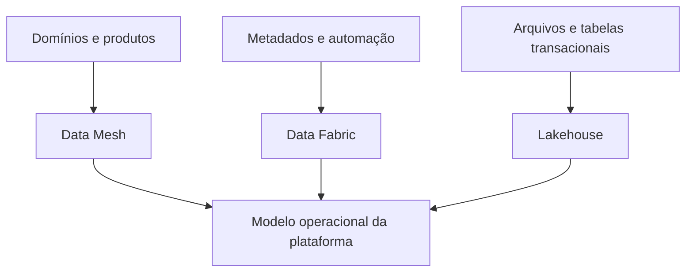

# Data Mesh, Data Fabric e Lakehouse na Prática

Data Mesh, Data Fabric e Lakehouse atuam em dimensões diferentes. Mesh é sobretudo modelo sociotécnico de ownership; Fabric enfatiza integração e automação por metadados; Lakehouse combina armazenamento aberto com capacidades de tabela analítica.

| Conceito | Pergunta principal |
|---|---|
| Data Mesh | quem possui e opera produtos por domínio? |
| Data Fabric | como integrar e automatizar em ambientes heterogêneos? |
| Lakehouse | como servir análise confiável sobre armazenamento aberto? |

Uma organização pode usar os três: domínios possuem produtos, metadados propagam políticas e tabelas abertas fornecem base compartilhada. Também pode precisar de apenas um. A adoção deve acompanhar escala, heterogeneidade e maturidade.

> [!warning]
> Comprar uma plataforma Lakehouse não cria ownership de domínio; instalar catálogo não cria Data Fabric; descentralizar tabelas não cria Data Mesh.

O consumo para ação é discutido em [[07-Reverse-ETL-Data-Sharing-e-Ativacao]].
