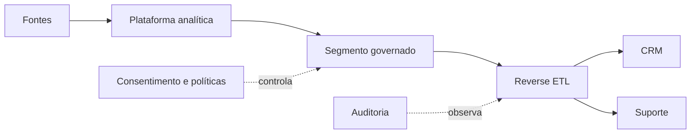

# Reverse ETL, Data Sharing e Ativação

Reverse ETL sincroniza dados derivados da plataforma analítica para sistemas operacionais, como CRM ou suporte. Ativação é o objetivo mais amplo de colocar dados em uso. Data sharing permite consulta ou troca entre organizações e plataformas.

## Riscos operacionais

Escrever de volta cria efeitos no mundo: campanhas, limites e atendimento. São necessários identidade, consentimento, minimização, idempotência, reconciliação, rate limits e tratamento de exclusão.

Compartilhamento pode copiar dados ou oferecer acesso sem cópia por protocolo e catálogo. “Zero-copy” reduz duplicação física, mas não elimina custo computacional, governança, contrato ou risco de inferência.

> [!tip]
> Trate destinos operacionais como efeitos externos: use chaves idempotentes, registre versão e reconcilie o resultado.

Entrega contínua e economia são integradas em [[08-DataOps-FinOps-e-Engenharia-de-Plataforma]].
