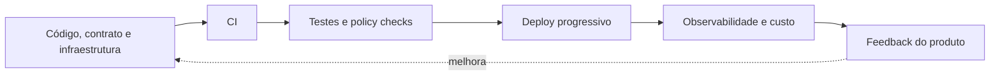

# DataOps, FinOps e Engenharia de Plataforma

DataOps aplica colaboração, automação, versionamento, testes, observabilidade e melhoria contínua ao ciclo de vida dos dados. Não é uma ferramenta nem simples cópia de DevOps: dados trazem estado histórico, qualidade contextual e múltiplos consumidores.

FinOps cria responsabilidade compartilhada pelo valor e custo da nuvem. Engenharia de plataforma oferece experiências reutilizáveis que tornam práticas confiáveis acessíveis às equipes.

## Métricas úteis

- lead time e frequência de mudanças;
- taxa de falha e tempo de recuperação;
- custo por pipeline, domínio ou produto;
- utilização e desperdício;
- adoção dos golden paths;
- SLO e valor percebido pelo consumidor.

Showback torna custo visível; chargeback o atribui financeiramente. Ambos dependem de tags, unidades e ownership confiáveis.

> [!note]
> Otimizar custo sem observar valor pode remover capacidade crítica; escalar sem atribuir custo incentiva desperdício.

Automação avançada é discutida em [[09-IA-Metadados-Ativos-e-Tendencias]].
