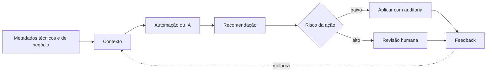

# IA, Metadados Ativos e Tendências

IA pode auxiliar descoberta, documentação, mapeamento, geração de testes, classificação e diagnóstico. O resultado deve ser tratado como proposta sujeita a validação, especialmente quando altera produção, acesso ou semântica.

Metadados ativos fecham o ciclo entre contexto e ação: schema alterado notifica consumidores, classificação aplica política, custo anômalo cria investigação e linhagem prioriza impacto.

## Controles

Proteja prompts e contexto, minimize dados sensíveis, avalie acurácia, registre proveniência, limite permissões e mantenha rollback. Sistemas generativos não substituem ownership semântico.

## Tendências duráveis

Interfaces abertas, contratos, produtos, automação por metadados, computação elástica e observabilidade tendem a permanecer relevantes, mesmo que ferramentas e nomes mudem.

> [!warning]
> Código gerado que executa não é necessariamente correto, seguro, eficiente ou semanticamente compatível.

Veja a síntese aplicada em [[10-Estudo-de-Caso-DataRetail]].
