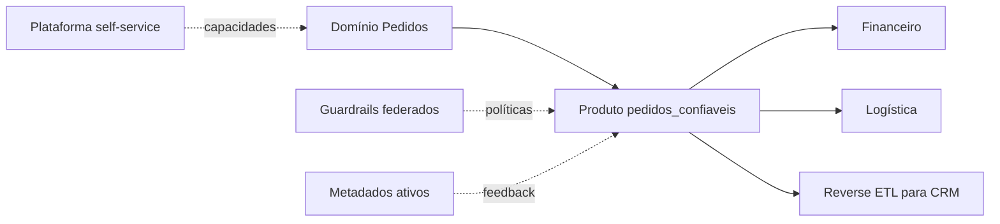

# Estudo de Caso — Plataforma Moderna da DataRetail

A DataRetail S.A. possuía pipelines centralizados e uma fila crescente de solicitações. Em vez de substituir toda a tecnologia, escolheu evoluir o modelo operacional por produtos e capacidades self-service.

## Primeiro produto

`pedidos_confiaveis` recebeu owner, consumidores, contrato, SLO, qualidade, classificação, linhagem e custo. A plataforma forneceu template de pipeline, CI, catálogo, observabilidade e solicitação de acesso.

## Evolução

O Lakehouse armazenou histórico aberto, enquanto marts financeiros permaneceram no Warehouse durante a migração. Metadados propagaram classificação e alertas. Reverse ETL usou consentimento e chaves idempotentes. FinOps expôs custo por produto.

## Critérios de expansão

Outros domínios só publicam produtos quando demonstram owner, uso, contrato, qualidade, acesso, linhagem e custo. A plataforma mede tempo de entrega e satisfação para evitar abstrações sem demanda.

> [!example]
> A modernização foi incremental e orientada a propriedades. Nenhum rótulo exigiu reescrita total.

Consolide em [[11-Resumo]].
