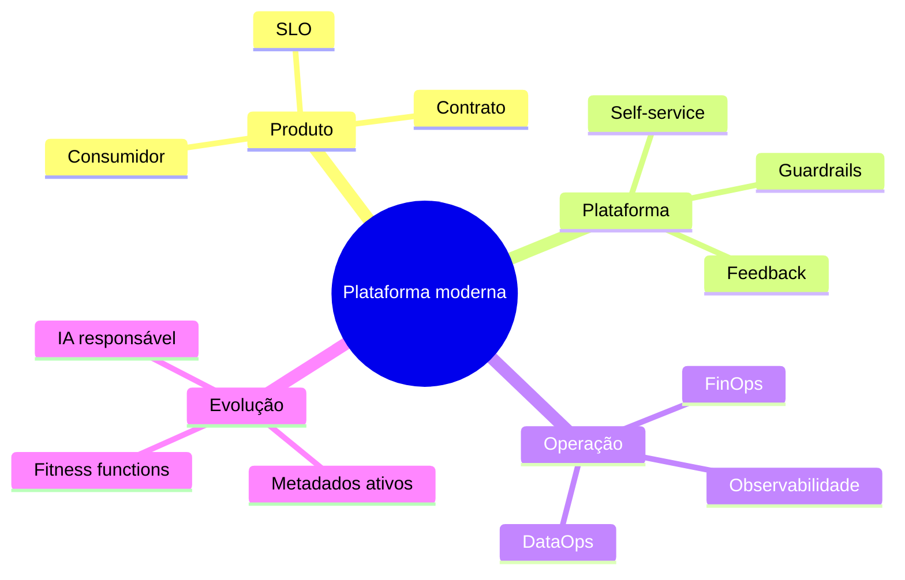

# Resumo

- Avalie tendências por problema, mecanismo, propriedade e custo.
- Produto de dados possui consumidor, owner, contrato e ciclo de vida.
- Plataforma self-service oferece capacidades e reduz carga cognitiva.
- Golden paths orientam; guardrails protegem limites críticos.
- Arquitetura evolutiva usa mudanças incrementais e fitness functions.
- Mesh, Fabric e Lakehouse atuam em dimensões diferentes.
- Reverse ETL produz efeitos externos e exige idempotência e consentimento.
- DataOps integra entrega, qualidade e operação.
- FinOps conecta custo, ownership e valor.
- Metadados ativos transformam contexto em ação.
- IA auxilia, mas requer validação, proveniência e limites.
- Fundamentos permanecem a melhor defesa contra hype.

Teste sua compreensão em [[12-Perguntas-de-Entrevista]] e [[13-Exercicios]].
