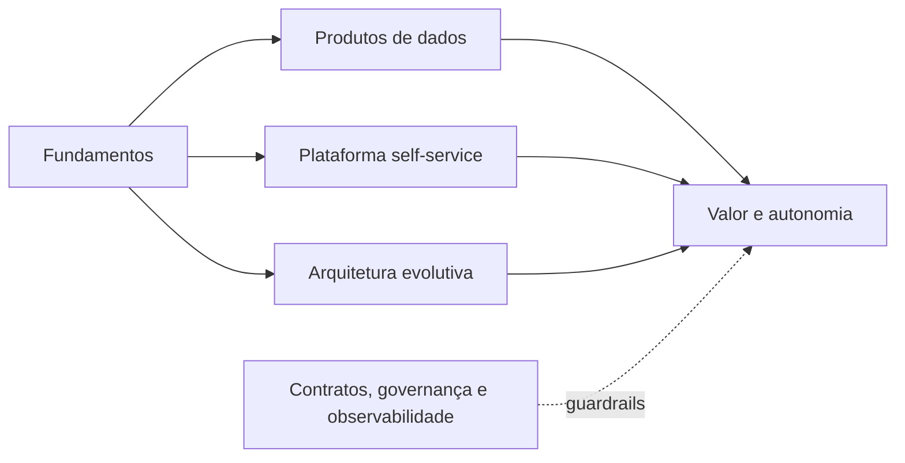

# Módulo 12 — Conceitos Modernos

> [!abstract]
> Conceitos modernos recombinam fundamentos para responder a escala, autonomia, interoperabilidade e velocidade. O valor está nas propriedades obtidas, não no rótulo ou na ferramenta adotada.

## Estrutura

- [[01-Objetivos]]
- [[02-Introducao]]
- [[03-O-que-sao-Conceitos-Modernos-em-Dados]]
- [[04-Produtos-de-Dados-e-Contratos]]
- [[05-Arquitetura-Evolutiva-e-Plataformas-Self-Service]]
- [[06-Data-Mesh-Data-Fabric-e-Lakehouse-na-Pratica]]
- [[07-Reverse-ETL-Data-Sharing-e-Ativacao]]
- [[08-DataOps-FinOps-e-Engenharia-de-Plataforma]]
- [[09-IA-Metadados-Ativos-e-Tendencias]]
- [[10-Estudo-de-Caso-DataRetail]]
- [[11-Resumo]]
- [[12-Perguntas-de-Entrevista]]
- [[13-Exercicios]]
- [[13-Gabarito]]
- [[14-Laboratorio]]
- [[14-Solucao]]
- [[15-Referencias]]

## Projeto integrador

A DataRetail S.A. avaliará automaticamente a prontidão de seus produtos de dados por contrato, ownership, qualidade, acesso, linhagem e custo.
