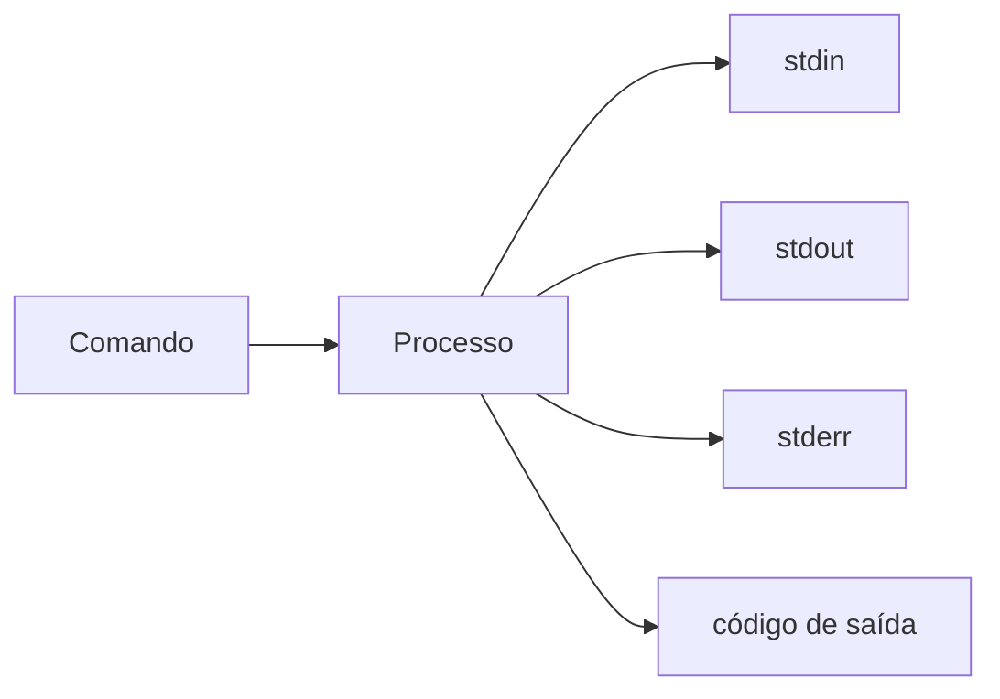

# Introdução

Servidores, containers, clusters e serviços de nuvem frequentemente expõem interfaces Linux. Para engenharia de dados, isso significa iniciar processos, observar recursos, proteger credenciais, movimentar arquivos e automatizar rotinas.

O terminal não é uma coleção de comandos mágicos. Cada comando lê entradas, produz saídas, retorna um status e opera sob identidade, permissões e ambiente definidos.

> [!warning]
> Comandos executados como administrador podem alterar todo o sistema. Entenda alvo, expansão e efeito antes de confirmar operações destrutivas.

Continue em [[03-Linux-e-o-Papel-na-Engenharia-de-Dados]].
