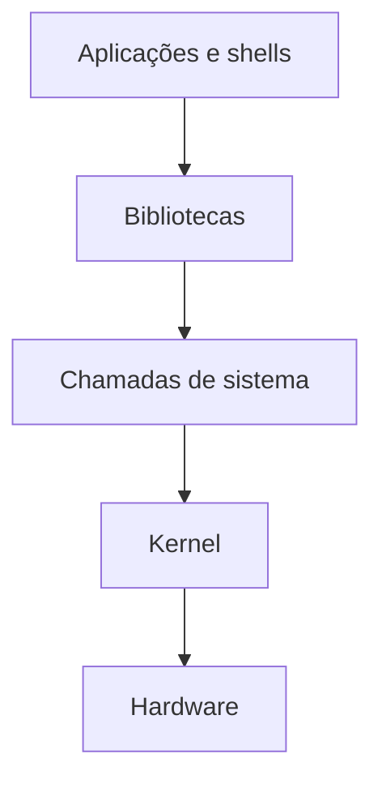

# Arquitetura, Kernel, Shell e Distribuições

O kernel gerencia processos, memória, dispositivos, filesystem, rede e segurança. Programas usam chamadas de sistema para solicitar seus serviços. O shell interpreta comandos e coordena processos; Bash, Dash e Zsh são implementações diferentes.



Uma distribuição combina kernel, utilitários, bibliotecas, gerenciador de pacotes, instalador e políticas de atualização. Debian, Ubuntu, Red Hat Enterprise Linux e outras possuem ciclos e escolhas diferentes.

## Descoberta do ambiente

```bash
uname -a
cat /etc/os-release
printf '%s\n' "$SHELL"
```

Variáveis de ambiente influenciam localização de executáveis, idioma e configuração. `PATH` é uma lista ordenada; executar binários de diretórios graváveis por terceiros cria risco.

> [!tip]
> Scripts portáveis devem declarar o interpretador e evitar assumir recursos específicos sem verificação.

O filesystem é apresentado em [[05-Sistema-de-Arquivos-Caminhos-e-Tipos]].
