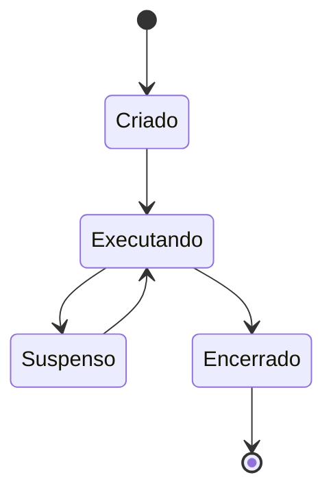

# Processos, Sinais, Serviços e Recursos

Processo é uma instância de programa com PID, processo pai, credenciais, memória, descritores e estado. O kernel agenda threads e contabiliza recursos.

```bash
ps -ef
pgrep -a python
top
free -h
df -h
du -sh dados
```

## Sinais

`SIGTERM` solicita término e permite limpeza. `SIGKILL` encerra sem tratamento e deve ser último recurso. `SIGHUP` costuma indicar recarga, conforme a aplicação.

```bash
kill -TERM "$pid"
```

Serviços de longa duração são supervisionados por um init system, frequentemente systemd. A unidade define comando, dependências, identidade, reinício e limites. `systemctl status` mostra estado; `journalctl` consulta o journal quando disponível.



> [!warning]
> Disco livre e memória disponível não contam toda a história. Inodes, I/O, swap, limites e pressão também podem causar falhas.

O terminal conecta essas observações em [[08-Terminal-Comandos-Documentacao-e-Pipes]].
