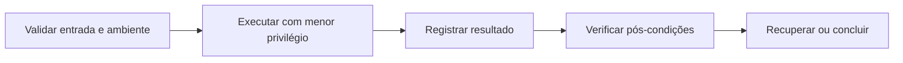

# Segurança, Ambientes e Boas Práticas

Operação segura começa por menor privilégio, atualização controlada, origem confiável de pacotes, logs, backups e separação de ambientes. Credenciais não devem aparecer em argumentos, histórico ou repositório.

## Shell script defensivo

```bash
#!/usr/bin/env bash
set -Eeuo pipefail
IFS=$'\n\t'
```

Aspas em `"$variavel"` preservam o argumento. Diretórios temporários devem ser criados com `mktemp -d` e removidos por `trap`. Valide pré-condições e caminhos antes de modificar estado.

## Configuração

Variáveis de ambiente são convenientes, mas podem vazar por diagnósticos. Arquivos de configuração precisam de permissões adequadas. Segredos devem vir de mecanismos próprios e ter rotação.

## Reprodutibilidade

Registre versão do sistema e dependências, torne scripts idempotentes e use logs estruturados. Teste restauração, não apenas backup.



> [!warning]
> Copiar comandos privilegiados sem compreender expansão, caminho e contexto é uma causa frequente de incidentes.

Veja a aplicação em [[10-Estudo-de-Caso-DataRetail]].
