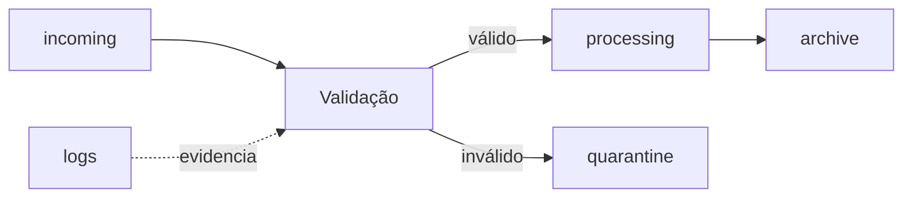

# Estudo de Caso — Servidor de Ingestão da DataRetail

A DataRetail S.A. recebe arquivos de pedidos. Antes, operadores usavam diretório compartilhado, permissões amplas e scripts sem logs. Um arquivo era sobrescrito ou processado duas vezes sem evidência.

## Desenho

O serviço usa identidade própria e grupo operacional. Diretórios têm permissões mínimas, `umask 027` e arquivos de controle. O script valida nome e hash, move atomicamente dentro do mesmo filesystem e escreve logs separados de dados.

## Diagnóstico

Em atraso, a equipe verifica processo, espaço, inodes, permissões e logs antes de reiniciar. `SIGTERM` permite concluir o arquivo atual. O runbook proíbe apagar a fila para liberar espaço; arquivos são arquivados conforme retenção.

> [!example]
> Linux fornece mecanismos; confiabilidade nasce da combinação entre identidade, filesystem, processo, script idempotente e evidência.

Consolide em [[11-Resumo]].
