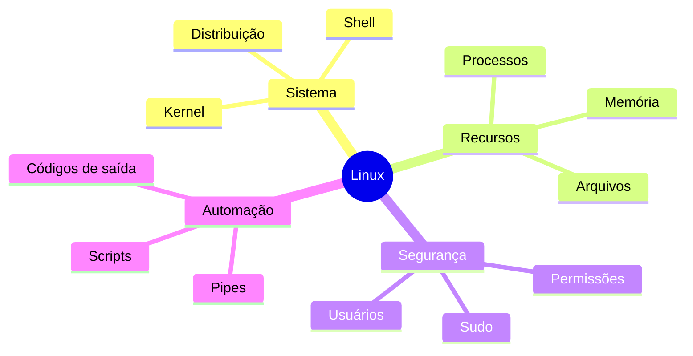

# Resumo

- O kernel gerencia recursos; o shell coordena programas.
- Distribuições combinam kernel, utilitários, pacotes e políticas.
- Caminhos formam uma árvore iniciada em `/`.
- Inodes mantêm metadados; nomes referenciam inodes.
- Processos executam com identidade, grupos e ambiente.
- Permissões diferem em arquivos e diretórios.
- `sudo` aplica elevação delimitada e auditável.
- Sinais comunicam eventos a processos.
- stdout, stderr, códigos de saída e pipes sustentam composição.
- Aspas, validação de caminhos e menor privilégio evitam acidentes.
- Scripts idempotentes e evidências melhoram recuperação.

Continue em [[12-Perguntas-de-Entrevista]] e [[13-Exercicios]].
