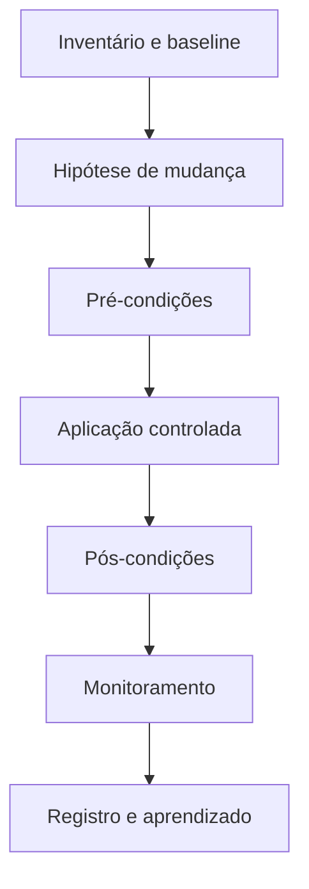

# Introdução

Um servidor é um conjunto de estados interdependentes: versões, serviços, mounts, rede, identidades, limites e dados persistentes. Alterar um pacote pode reiniciar um daemon; montar caminho errado pode ocultar dados; liberar porta pode ampliar exposição.

Administração profissional privilegia mudanças pequenas, reproduzíveis, observáveis e reversíveis. Acesso privilegiado deve ser temporário e auditado.

> [!warning]
> “Funcionou no terminal” não comprova persistência após reboot, segurança nem capacidade de recuperação.

Continue em [[03-Responsabilidade-e-Ciclo-de-Administracao]].
