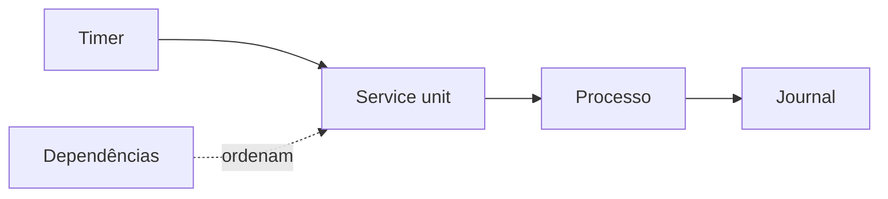

# Systemd, Serviços, Timers e Journal

Systemd gerencia unidades e dependências. Service units descrevem processos; timer units agendam ativações; mount units representam mounts. Estado ativo não garante que a aplicação cumpra seu contrato, por isso combine status e health check.

```bash
systemctl status dataretail.service
systemctl list-dependencies dataretail.service
journalctl -u dataretail.service --since today
```

Uma unidade define `ExecStart`, identidade, ambiente, reinício, dependências e hardening. Use caminhos absolutos e credenciais fora do arquivo. `daemon-reload` relê unidades; `enable` configura boot; `start` inicia agora.

Timers persistentes podem recuperar uma execução perdida durante desligamento. Para fluxos de dados complexos, um orquestrador continua mais apropriado.



> [!tip]
> Configure limites e política de restart; reinício infinito pode esconder erro determinístico e gerar tempestade.

Persistência depende de [[06-Armazenamento-Discos-Mounts-e-Filesystems]].
