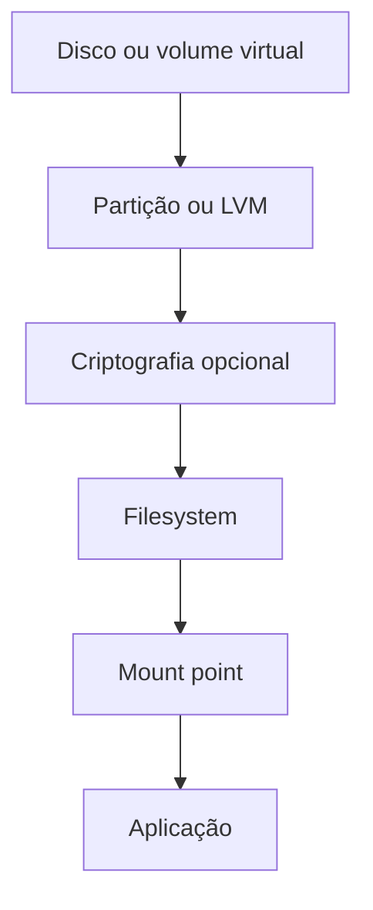

# Armazenamento, Discos, Mounts e Filesystems

Dispositivos de bloco podem conter partições, RAID, volumes lógicos, criptografia e filesystems. Mount associa a raiz de um filesystem a um diretório da árvore.



```bash
lsblk -f
findmnt
df -hT
df -i
du -xsh /var/lib/aplicacao
```

`/etc/fstab` define mounts persistentes. Prefira UUID, opções restritivas e teste com `mount -a` antes do reboot. Montar sobre diretório não vazio oculta seu conteúdo até desmontar.

Capacidade inclui bytes, inodes, IOPS, throughput e latência. Filesystem cheio pode impedir logs e recuperação. Expansão deve considerar todas as camadas.

> [!warning]
> Formatação e particionamento são destrutivos. Confirme dispositivo, backup e caminho por mais de uma evidência.

Conectividade é tratada em [[07-Rede-Nomes-Portas-e-Diagnostico]].
