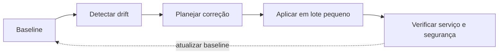

# Capacidade, Hardening, Manutenção e Automação

Capacidade deve considerar tendência, pico, margem e tempo de expansão. CPU, memória, swap, disco, inodes, I/O, rede, PIDs e descritores podem limitar serviços.

Hardening reduz superfície: remover serviços desnecessários, corrigir vulnerabilidades, limitar acesso, proteger boot e credenciais, aplicar MAC quando apropriado e auditar mudanças.

## Automação

Automação declarativa converge ao estado desejado; scripts imperativos precisam de idempotência e verificações. Separe planejamento de aplicação e ofereça modo dry-run quando possível.

```bash
ulimit -a
systemctl --failed
ss -lntup
find /etc -xdev -type f -perm -0002
```



> [!note]
> Hardening precisa respeitar função e ameaça. Controle que quebra recuperação ou observabilidade pode aumentar risco total.

Veja o caso integrado em [[10-Estudo-de-Caso-DataRetail]].
