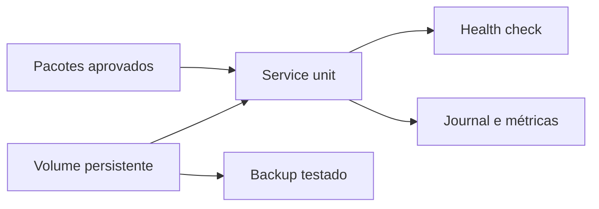

# Estudo de Caso — Host de Processamento da DataRetail

A DataRetail S.A. opera um serviço de ingestão em Linux. Após atualização manual, o serviço não iniciou no reboot e o volume de dados montou no caminho errado.

## Correção estrutural

- pacotes passam por repositório aprovado e rollout gradual;
- service unit usa identidade própria, health check e restart limitado;
- volume é referenciado por UUID e validado com `mount -a`;
- logs têm rotação e acesso restrito;
- backup inclui configuração, manifestos e dados necessários;
- auditoria diária verifica serviço, mount, capacidade e backup.

Em manutenção, a equipe registra baseline, drena trabalho, aplica mudança, verifica mount e serviço, acompanha SLO e mantém rollback. O incidente originou teste de reboot em ambiente de homologação.

> [!example]
> Persistência após reinício é uma propriedade que precisa ser testada, não inferida do estado atual.

Consolide em [[11-Resumo]].
