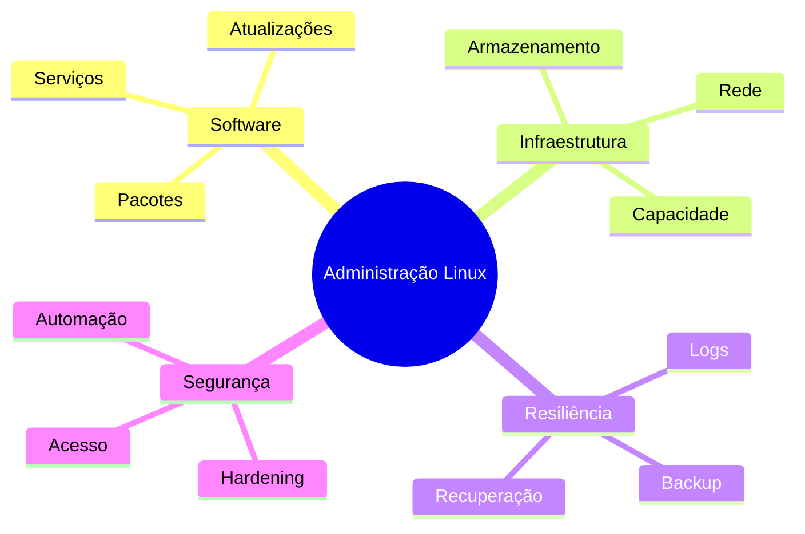

# Resumo

- Administração controla mudanças de estado com evidência e rollback.
- Pacotes dependem de repositórios, assinaturas, versões e compatibilidade.
- Systemd supervisiona unidades, dependências, timers e logs.
- Mount conecta filesystem à árvore e precisa persistir corretamente.
- Capacidade inclui bytes, inodes, I/O e latência.
- Diagnóstico de rede separa DNS, rota, transporte, TLS e aplicação.
- Logs exigem retenção e rotação.
- Backup só é confiável após restauração testada.
- Hardening reduz superfície sem ignorar operação e recuperação.
- Automação deve ser idempotente, observável e gradual.

Continue em [[12-Perguntas-de-Entrevista]] e [[13-Exercicios]].
