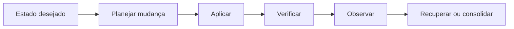

# Módulo 02 — Administração do Sistema Linux

> [!abstract]
> Administrar Linux significa manter o sistema disponível, seguro, recuperável e explicável. Toda mudança deve considerar dependências, evidências, rollback e impacto sobre os serviços de dados.

## Estrutura

- [[01-Objetivos]]
- [[02-Introducao]]
- [[03-Responsabilidade-e-Ciclo-de-Administracao]]
- [[04-Gerenciamento-de-Pacotes-e-Atualizacoes]]
- [[05-Systemd-Servicos-Timers-e-Journal]]
- [[06-Armazenamento-Discos-Mounts-e-Filesystems]]
- [[07-Rede-Nomes-Portas-e-Diagnostico]]
- [[08-Logs-Rotacao-Backup-e-Recuperacao]]
- [[09-Capacidade-Hardening-Manutencao-e-Automacao]]
- [[10-Estudo-de-Caso-DataRetail]]
- [[11-Resumo]]
- [[12-Perguntas-de-Entrevista]]
- [[13-Exercicios]]
- [[13-Gabarito]]
- [[14-Laboratorio]]
- [[14-Solucao]]
- [[15-Referencias]]

## Projeto integrador

A DataRetail S.A. implementará uma auditoria idempotente de prontidão para configuração, serviços, armazenamento e backup.
