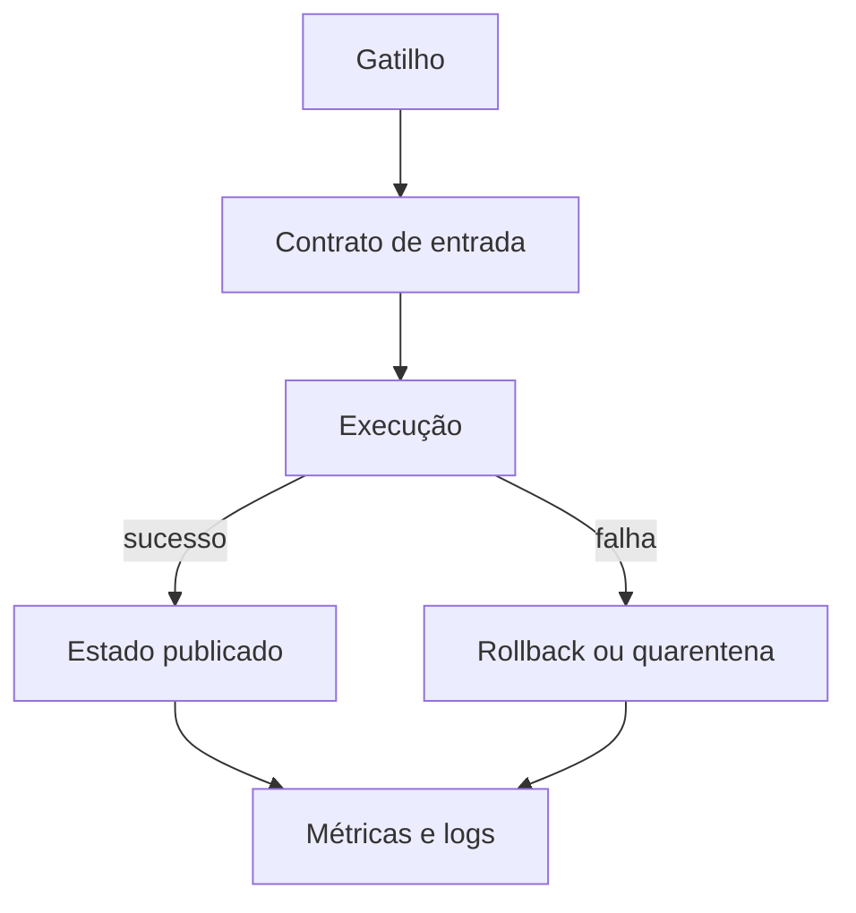

# Introdução

O shell conecta processos por arquivos, descritores e códigos de saída. Essa proximidade do sistema operacional torna Bash excelente para inicialização, integração de utilitários, rotinas operacionais e pequenos fluxos de dados. Também torna seus erros perigosos: uma variável vazia, uma expansão sem aspas ou uma repetição inesperada pode atingir muitos arquivos.

## Quando usar

Use shell quando o problema é predominantemente orquestrar comandos, manipular poucos dados textuais ou preparar um ambiente. Prefira Python, Java ou outra linguagem quando houver estruturas de dados complexas, regras extensas, alto volume em memória ou necessidade de bibliotecas especializadas.

| Propriedade | Pergunta de projeto |
| --- | --- |
| Determinismo | a mesma entrada produz a mesma saída? |
| Idempotência | repetir preserva o estado correto? |
| Atomicidade | consumidores veem apenas resultados completos? |
| Observabilidade | é possível explicar sucesso, falha e duração? |
| Segurança | entradas e privilégios estão limitados? |

## Automação como sistema

> [!warning]
> `set -e` não transforma um script em transação. Consistência exige desenho explícito de arquivos temporários, validação, publicação e recuperação.

Avance para [[03-Modelo-de-Execucao-e-Sintaxe-do-Shell]].
