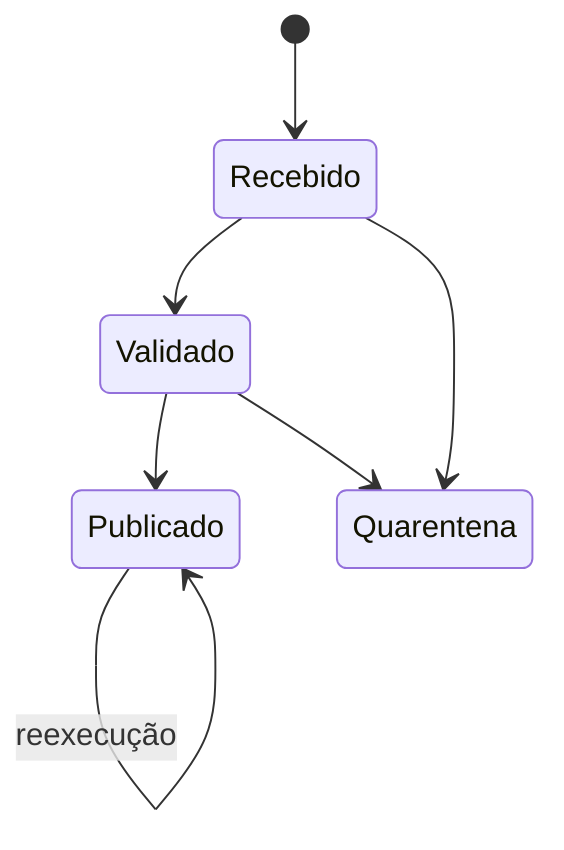

# Erros, Sinais, Traps e Idempotência

Falhar cedo é útil somente quando a falha preserva evidências e estado consistente. O contrato precisa dizer o que é recuperável, qual status retorna e o que será limpo.

## Modo estrito com contexto

```bash
set -Eeuo pipefail
trap 'printf "erro linha=%d status=%d\n" "$LINENO" "$?" >&2' ERR
```

- `-e` encerra em diversas falhas não tratadas, mas possui exceções em testes, listas e contextos de funções;
- `-u` rejeita variáveis ausentes;
- `pipefail` torna o pipeline sensível a falhas anteriores;
- `-E` propaga `ERR` para funções e subshells.

Não dependa apenas dessas opções: trate falhas esperadas com `if`, `||` ou captura explícita.

## Recursos e sinais

```bash
tmp=$(mktemp -d)
cleanup() { rm -rf -- "$tmp"; }
trap cleanup EXIT
trap 'exit 130' INT
trap 'exit 143' TERM
```

O diretório temporário deve ser criado pelo sistema, ter caminho conhecido e ser removido por trap. Em produção, preserve artefatos de diagnóstico quando a política exigir.

## Retentativa limitada

```bash
for tentativa in 1 2 3 4; do
  if consultar_servico; then break; fi
  (( tentativa == 4 )) && exit 75
  sleep $((2 ** (tentativa - 1)))
done
```

Repita somente operações transitórias e idempotentes. Defina limite, *backoff*, timeout e telemetria; não retente erros de autenticação ou validação.

## Idempotência e atomicidade

Idempotência pode ser obtida por estado desejado (`mkdir -p`), chave natural, checksum ou marcador transacional. Atomicidade em um filesystem pode usar arquivo temporário no mesmo volume e `mv`:

```bash
temporario=$(mktemp "${destino}.tmp.XXXXXX")
gerar >"$temporario"
validar "$temporario"
mv -f -- "$temporario" "$destino"
```

Para impedir sobreposição, use `flock` quando disponível ou um diretório de lock criado atomicamente, com política para locks órfãos.



Veja o emprego desses princípios em [[14-Solucao]].
