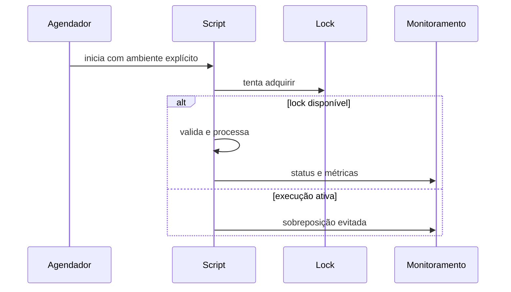

# Segurança, Portabilidade, Agendamento e Operação

Uma automação herda identidade, ambiente, limites e filesystem do processo que a inicia. O mesmo script pode se comportar de forma diferente no terminal, no cron, em um timer ou em um contêiner.

## Fronteiras de confiança

- valide opções, nomes e intervalos antes do uso;
- nunca use `eval` para transformar entrada em comando;
- passe argumentos por arrays, não por concatenação de strings;
- defina `PATH` conhecido e use menor privilégio;
- leia segredos de mecanismo apropriado, não de argumentos nem logs;
- aplique `umask 027` ou política mais restritiva;
- não execute arquivos graváveis por usuários não confiáveis.

```bash
readonly PATH='/usr/local/bin:/usr/bin:/bin'
export PATH
umask 027
[[ ${tabela:-} =~ ^[a-z_][a-z0-9_]*$ ]] || exit 64
comando=(psql --set ON_ERROR_STOP=1 --file "$sql")
"${comando[@]}"
```

## Bash ou POSIX `sh`

Bash oferece arrays, condicionais estendidos, `pipefail`, regex e substituições adicionais. POSIX `sh` alcança mais sistemas, mas com menos recursos. Declare a escolha no shebang e teste no interpretador-alvo; não use `#!/bin/sh` em código que depende de Bash.

## Agendamento

| Mecanismo | Uso típico | Controle relevante |
| --- | --- | --- |
| cron | agenda simples | ambiente mínimo e prevenção de sobreposição |
| systemd timer | host Linux gerenciado | dependências, journal e política de reinício |
| orquestrador | pipelines de dados | retries, lineage, SLA e dependências |

Forneça diretório de trabalho absoluto, timeout, lock, usuário de serviço, variáveis explícitas e destino dos logs. Um agendador inicia trabalho; não garante idempotência nem semântica *exactly once*.

## Observabilidade

Logs estruturados devem incluir horário UTC, execução, etapa, status e contagens, sem dados pessoais ou segredos. Exponha duração e atraso do último sucesso. Alertas devem distinguir falha transitória, entrada inválida e violação de contrato.



Aplicação integrada: [[10-Estudo-de-Caso-DataRetail]].
