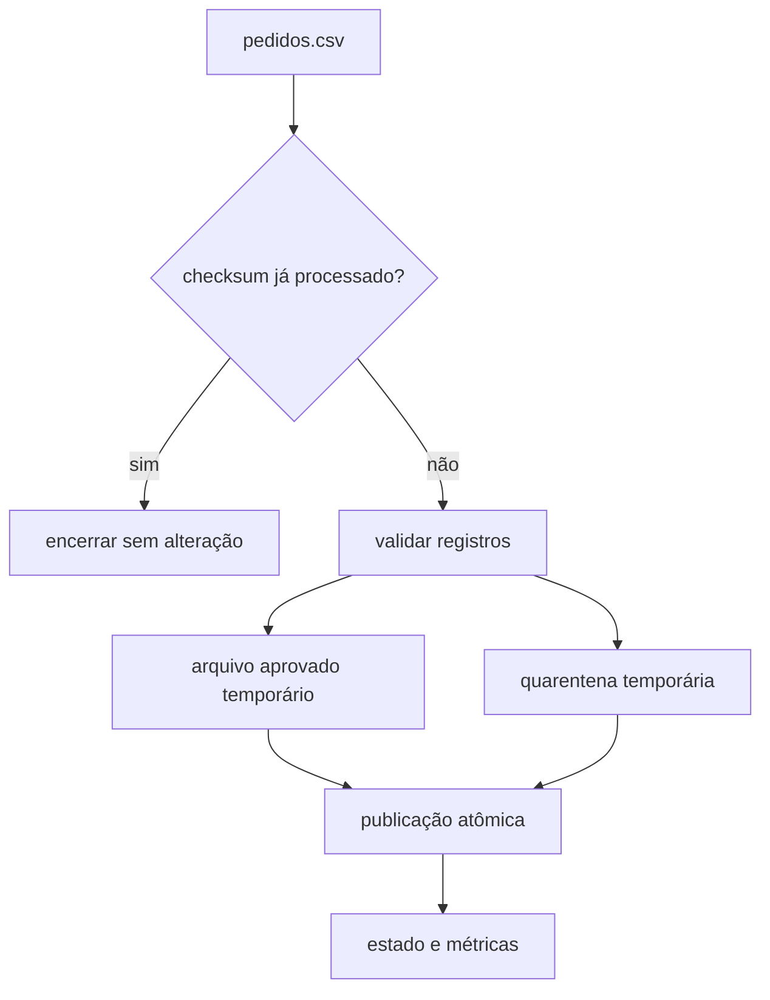

# Estudo de Caso — DataRetail S.A.

A DataRetail S.A. recebe, a cada hora, um arquivo simplificado de pedidos de uma aplicação legada. A rotina antiga acrescentava registros diretamente ao destino, era executada pelo cron e duplicava pedidos quando havia retentativa.

## Contrato

Cada linha contém `pedido_id,status,valor`. O identificador deve ser único no arquivo, o status deve pertencer ao domínio conhecido e o valor deve ser não negativo. Registros inválidos seguem para quarentena com motivo; arquivos válidos são publicados de forma atômica.

## Decisões

| Risco | Controle |
| --- | --- |
| repetição do mesmo arquivo | checksum armazenado em estado |
| processo interrompido | temporários e `trap` de limpeza |
| leitura de saída parcial | `mv` após validação |
| duplicata de pedido | mapa associativo por `pedido_id` |
| entrada malformada | validação antes da transformação |
| execuções simultâneas | lock no ambiente operacional |
| diagnóstico insuficiente | contagens, status e código de saída |

## Fluxo proposto

## Evolução

Bash atende enquanto o arquivo é pequeno, o formato é controlado e o host já possui as ferramentas. Com CSV completo, alto volume ou regras complexas, a empresa deve migrar o parser para uma biblioteca adequada, preservando contrato, idempotência, quarentena e observabilidade.

## Critérios de aceite

- duas execuções da mesma entrada produzem hashes idênticos;
- um registro válido por identificador é aprovado;
- inválidos e duplicados têm motivo;
- nenhum consumidor observa arquivo incompleto;
- falhas retornam status diferente de zero;
- o laboratório funciona sem privilégios administrativos.

Implemente o cenário em [[14-Laboratorio]].
