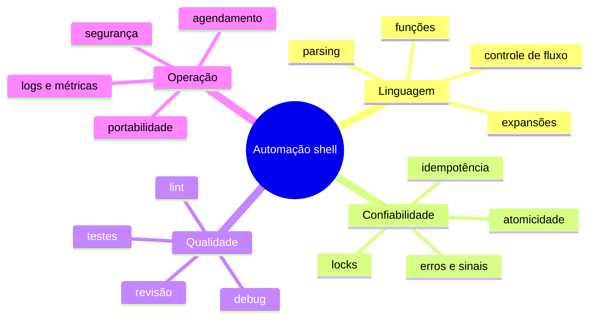

# Resumo

Shell script é adequado para compor processos e automatizar operações próximas ao sistema. Confiabilidade resulta de contratos explícitos, não de quantidade de comandos.

## Mapa conceitual

## Regras essenciais

1. Cite expansões que representam argumentos: `"$arquivo"` e `"$@"`.
2. Use códigos de saída e fluxos stdout/stderr de modo intencional.
3. Valide entradas antes de produzir efeitos.
4. Trate arquivos temporários e sinais com ciclo de vida definido.
5. Publique somente resultados validados e completos.
6. Projete repetição e concorrência, não apenas o caminho feliz.
7. Teste sintaxe, funções, integração, falha e reexecução.
8. Execute com menor privilégio e ambiente explícito.

## Decisão de tecnologia

Permaneça no shell quando a tarefa for orquestração curta e observável. Migre quando estruturas e regras dominarem o código, quando parsing exigir formato complexo ou quando testes e manutenção se tornarem desproporcionais.

> [!note]
> `set -Eeuo pipefail`, ShellCheck e cron são mecanismos. O fundamento é um desenho que preserve invariantes diante de entradas ruins, falhas e repetições.

Avalie-se em [[12-Perguntas-de-Entrevista]] e [[13-Exercicios]].
