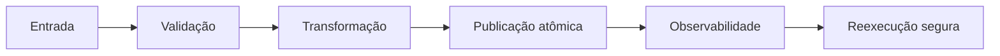

# Módulo 03 — Shell Script e Automação

Automação confiável não é uma sequência de comandos copiada do terminal. É software operacional: recebe entradas, explicita contratos, falha de modo observável e pode ser executado novamente sem corromper o estado.

## Percurso

1. [[01-Objetivos|Objetivos]]
2. [[02-Introducao|Introdução]]
3. [[03-Modelo-de-Execucao-e-Sintaxe-do-Shell|Modelo de Execução e Sintaxe]]
4. [[04-Variaveis-Expansoes-Arrays-e-Entrada|Variáveis, Expansões, Arrays e Entrada]]
5. [[05-Condicionais-Lacos-Funcoes-e-Modularidade|Condicionais, Laços, Funções e Modularidade]]
6. [[06-Erros-Sinais-Traps-e-Idempotencia|Erros, Sinais, Traps e Idempotência]]
7. [[07-Texto-Arquivos-Processos-e-Paralelismo|Texto, Arquivos, Processos e Paralelismo]]
8. [[08-Testes-Debug-Lint-e-Qualidade|Testes, Debug, Lint e Qualidade]]
9. [[09-Seguranca-Portabilidade-Agendamento-e-Operacao|Segurança, Portabilidade, Agendamento e Operação]]
10. [[10-Estudo-de-Caso-DataRetail|Estudo de Caso — DataRetail S.A.]]
11. [[11-Resumo|Resumo]]
12. [[12-Perguntas-de-Entrevista|Perguntas de Entrevista]]
13. [[13-Exercicios|Exercícios]] e [[13-Gabarito|Gabarito]]
14. [[14-Laboratorio|Laboratório]] e [[14-Solucao|Solução]]
15. [[15-Referencias|Referências]]

> [!tip]
> Execute os exemplos em um diretório temporário e mantenha o princípio do menor privilégio.
