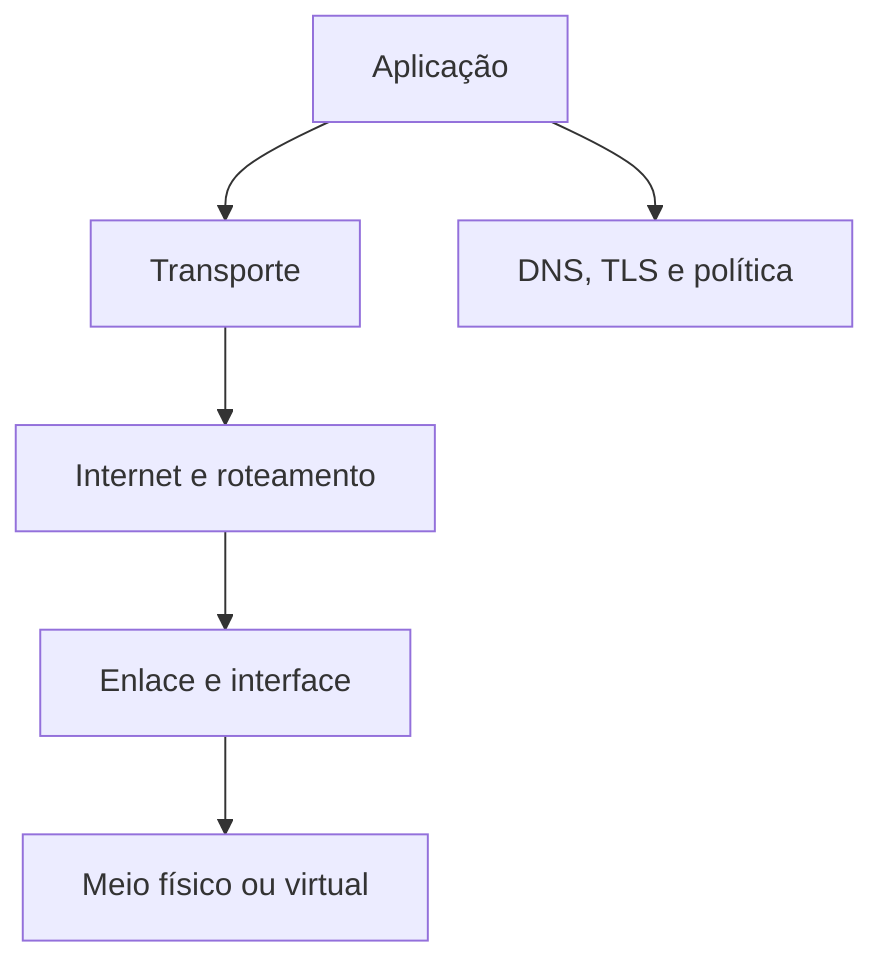

# Introdução

Uma consulta a um banco remoto atravessa várias decisões: transformar nome em endereço, escolher rota, alcançar o próximo salto, abrir transporte, negociar segurança e falar o protocolo da aplicação. A mensagem “conexão falhou” não identifica qual dessas etapas falhou.

## Modelo de investigação

O Linux expõe a pilha por comandos, pseudoarquivos, métricas e captura de pacotes. O objetivo não é memorizar ferramentas, mas formar hipóteses e testá-las da camada mais próxima até a aplicação.

## Vocabulário mínimo

| Termo | Significado |
| --- | --- |
| host | sistema participante da rede |
| interface | ponto lógico de envio e recepção |
| pacote | unidade da camada IP |
| rota | decisão de próximo salto |
| socket | endpoint entre processo e transporte |
| protocolo | regras compartilhadas de comunicação |

> [!warning]
> Responder a `ping` não prova que um banco está acessível; falhar no `ping` também não prova indisponibilidade, pois ICMP pode ser filtrado.

Comece em [[03-Camadas-Encapsulamento-e-Fluxo-de-Pacotes]].
