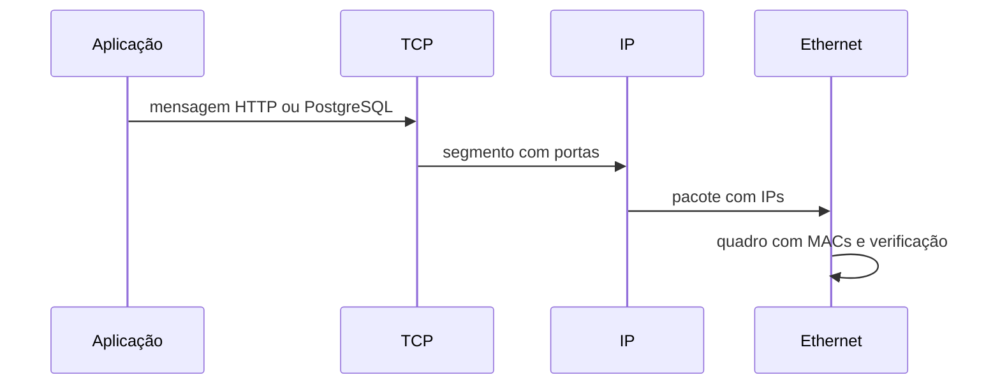

# Camadas, Encapsulamento e Fluxo de Pacotes

Camadas separam responsabilidades e permitem substituir uma tecnologia sem reescrever todo o sistema. O modelo OSI é uma referência de sete camadas; o modelo TCP/IP agrupa funções em aplicação, transporte, internet e acesso à rede.

| Dados | Unidade | Identificação principal |
| --- | --- | --- |
| aplicação | mensagem | nome, URL ou protocolo |
| transporte | segmento/datagrama | portas |
| internet | pacote | endereço IP |
| enlace | quadro | endereço MAC |

## Encapsulamento



No envio, cada camada acrescenta metadados. No recebimento, o kernel valida e remove cabeçalhos até entregar bytes ao socket do processo. Switches encaminham principalmente por enlace; roteadores, por IP; proxies podem interpretar a aplicação.

```bash
ip -brief link
ip -brief address
ip route show
ss -tn state established
```

Esses comandos observam, respectivamente, enlace, endereçamento, decisão de rota e transporte. Uma investigação eficiente registra horário, origem, destino e resultado em cada fronteira.

## Erros comuns

- tratar o modelo em camadas como implementação rígida;
- confundir pacote IP com quadro Ethernet;
- concluir que toda falha é “da rede” antes de testar o protocolo;
- capturar tráfego sem autorização ou proteção de dados.

Próximo: [[04-Interfaces-Enlace-ARP-NDP-e-MTU]].
