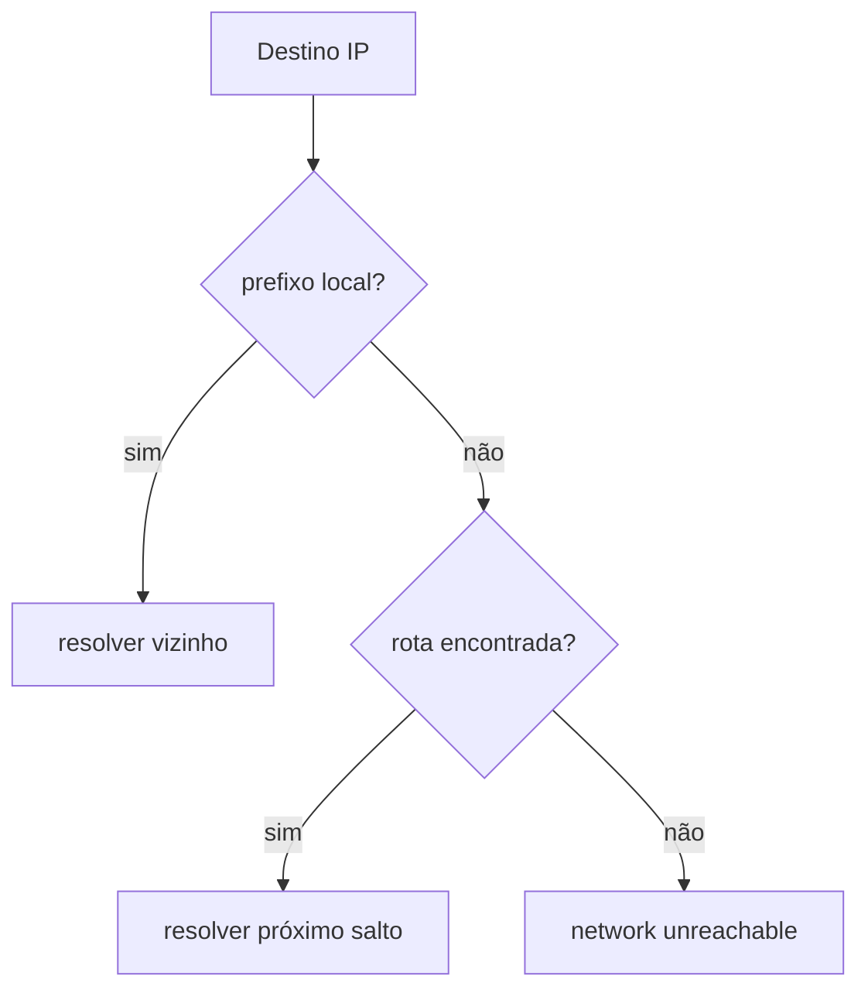

# Endereçamento IP, Sub-redes e Roteamento

O endereço IP identifica uma interface em um domínio de roteamento. CIDR escreve o tamanho do prefixo: `10.20.30.0/24` reserva 24 bits para rede e 8 para hosts. Sub-redes controlam alcance, broadcast IPv4 e políticas.

## Exemplo IPv4

Para `10.20.30.77/26`, cada bloco possui 64 endereços. O endereço pertence à rede `10.20.30.64`, o broadcast é `10.20.30.127` e, em uma sub-rede convencional, hosts vão de `.65` a `.126`.

```bash
ip -4 address show
ip route get 10.20.30.77
ip route show table main
```

O kernel seleciona primeiro o prefixo mais específico; depois considera métricas e regras de política. Se o destino é local, resolve o vizinho. Caso contrário, envia ao gateway da rota.

## IPv6

IPv6 usa 128 bits, não possui broadcast e depende fortemente de ICMPv6. Endereços link-local `fe80::/10` existem por interface; endereços globais e ULA atendem outros escopos. Não aplique hábitos de NAT IPv4 automaticamente ao IPv6.



## NAT e encaminhamento

NAT traduz endereços ou portas e mantém estado; não é sinônimo de firewall. Um host roteador precisa de forwarding, rotas e políticas coerentes em ambos os sentidos. Rotas assimétricas podem funcionar, mas confundem firewalls stateful e diagnóstico.

> [!warning]
> RFC 1918 define faixas privadas IPv4, mas “privado” não significa confiável. Autentique e autorize serviços mesmo dentro da rede corporativa.

Próximo: [[06-Transporte-Portas-Sockets-TCP-e-UDP]].
