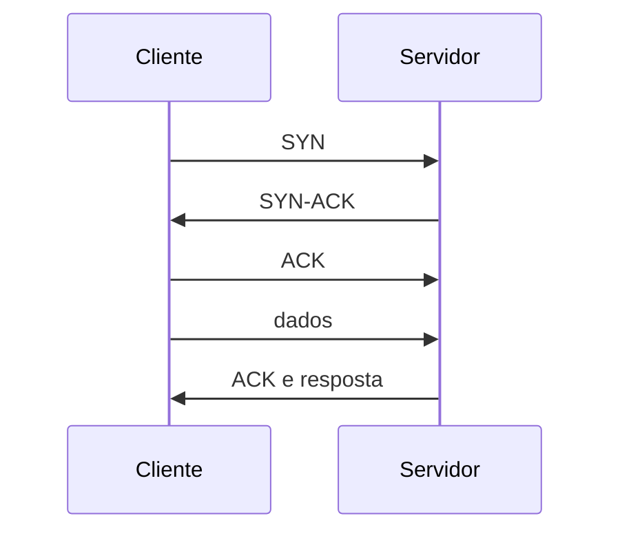

# Transporte, Portas, Sockets, TCP e UDP

O transporte associa comunicação a processos. Um socket de rede é definido por protocolo, endereços e portas. Servidores fazem `bind` e `listen`; clientes normalmente recebem uma porta efêmera.

## TCP

TCP fornece fluxo ordenado, retransmissão, controle de congestionamento e de fluxo. O handshake sincroniza estado; ele não prova que a aplicação está saudável.



`connection refused` geralmente indica que o destino respondeu sem listener ou que um filtro rejeitou. Timeout pode indicar descarte, rota, firewall ou serviço incapaz de responder. `TIME-WAIT` protege conexões antigas e, isoladamente, não é defeito.

## UDP

UDP preserva datagramas, mas não garante entrega, ordem nem controle de congestionamento. DNS, telemetria e streaming podem usá-lo; confiabilidade, quando necessária, pertence à aplicação.

```bash
ss -lntup
ss -tnp state established
ss -s
```

Portas abaixo de 1024 são privilegiadas em modelos tradicionais, mas capabilities e namespaces alteram o contexto. Uma porta aberta em `127.0.0.1` não está acessível por outra máquina; `0.0.0.0` representa todos os endereços IPv4 locais no bind.

## Desempenho

Throughput depende de latência, perda, janela, congestionamento e aplicação. Aumentar buffers sem evidência pode consumir memória e ocultar a causa. Meça retransmissões, RTT, filas e saturação antes de ajustar `sysctl`.

Continue em [[07-DNS-Resolucao-de-Nomes-e-Servicos]].
