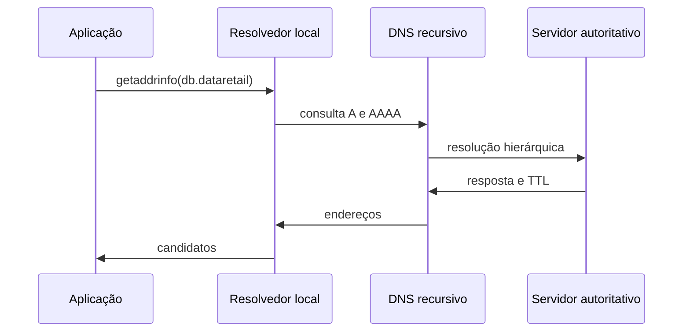

# DNS, Resolução de Nomes e Serviços

DNS é um banco distribuído e hierárquico. A aplicação costuma chamar o resolvedor do sistema, que pode consultar `/etc/hosts`, DNS, mDNS ou outras fontes segundo `/etc/nsswitch.conf`. Por isso, `dig` e a aplicação podem obter resultados diferentes.

## Resolução



Registros `A` e `AAAA` mapeiam nomes para endereços; `CNAME` cria alias; `MX` orienta e-mail; `TXT` carrega texto; `SRV` publica serviço, porta e prioridade. TTL controla por quanto tempo respostas podem ser armazenadas, não garante propagação instantânea.

```bash
getent ahosts db.dataretail.internal
resolvectl query db.dataretail.internal
dig +short A db.dataretail.internal
dig +trace example.org
```

`getent` aproxima o caminho da aplicação. `dig` consulta DNS diretamente e ajuda a inspecionar autoridade e cache. Verifique também search domains, `ndots`, servidor configurado e respostas negativas.

## Falhas comuns

- nome inexistente (`NXDOMAIN`);
- resposta temporariamente indisponível (`SERVFAIL`);
- endereço antigo em cache;
- split-horizon com respostas diferentes por rede;
- preferência IPv6 sem caminho IPv6 funcional;
- nome correto apontando para serviço errado.

> [!note]
> DNSSEC autentica dados DNS; TLS autentica e protege a sessão da aplicação. Um não substitui o outro.

Próximo: [[08-Configuracao-Network-Namespaces-e-Firewall]].
