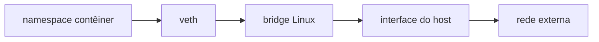

# Configuração, Network Namespaces e Firewall

Comandos `ip` alteram o estado corrente; NetworkManager, systemd-networkd, Netplan ou arquivos da distribuição tornam a configuração persistente. Misturar gestores pode causar rotas duplicadas ou mudanças após reboot.

```bash
ip -brief link
ip -brief address
ip route
ip rule
resolvectl status
```

Antes de alterar uma conexão remota, registre estado, planeje rollback e use janela segura. Uma rota ou firewall incorreto pode interromper o próprio canal administrativo.

## Namespaces e redes virtuais

Um network namespace possui interfaces, rotas, sockets e regras próprias. Pares `veth` conectam namespaces; bridges comutam interfaces virtuais; contêineres combinam esses mecanismos.



```bash
ip netns list
bridge link show
ip -d link show type veth
```

## Firewall

Netfilter oferece hooks no kernel; nftables é a interface moderna para filtros, NAT e marcação. Regras stateful acompanham conexões. Políticas devem partir do fluxo necessário: origem, destino, protocolo, porta, direção e estado.

```bash
nft list ruleset
conntrack -L
```

> [!warning]
> Não aplique exemplos de firewall diretamente em produção. Valide sintaxe, ordem, política padrão, IPv4/IPv6 e um caminho de recuperação fora de banda.

Boas práticas incluem menor exposição, regras documentadas, revisão de exceções, logs com limite de taxa e testes a partir da origem real. Continue em [[09-Diagnostico-Seguranca-Desempenho-e-Observabilidade]].
