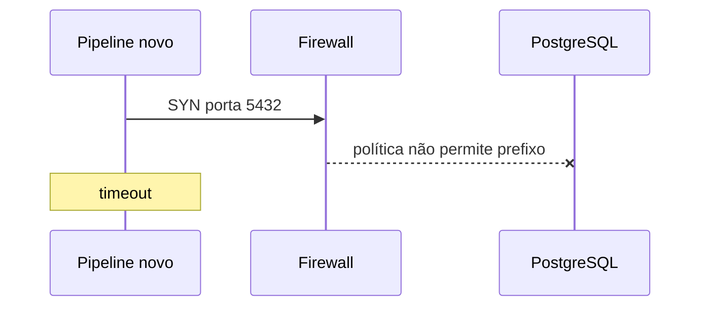

# Estudo de Caso — DataRetail S.A.

Após mover um pipeline para uma nova sub-rede, a DataRetail S.A. passou a observar timeout ao conectar ao PostgreSQL. O dashboard continuava funcionando a partir da sub-rede antiga.

## Evidências

- o nome resolvia para o IP correto em ambas as origens;
- a nova origem possuía rota pelo gateway esperado;
- SYNs saíam do novo host, mas não havia SYN-ACK;
- o banco escutava no endereço privado e aceitava a sub-rede antiga;
- a política de firewall não incluía o novo prefixo.

## Correção

A equipe adicionou uma regra mínima para origem, destino e porta específicos, com prazo e proprietário; testou TCP e autenticação PostgreSQL; registrou a mudança e removeu uma regra temporária ampla usada em homologação.

## Lições

Abrir a porta para qualquer origem teria mascarado a falha e ampliado risco. Alterar DNS ou reiniciar o banco não tinha relação causal. A investigação por camadas localizou o ponto exato e preservou evidências.

## Critérios operacionais

- monitor sintético abre sessão e executa consulta leve;
- logs do firewall distinguem deny sem inundação;
- inventário relaciona serviço, sub-rede e proprietário;
- mudanças de rede incluem teste de ida, retorno, DNS e TLS;
- runbook registra comandos somente leitura antes de correções.

Reproduza uma versão segura do raciocínio em [[14-Laboratorio]].
