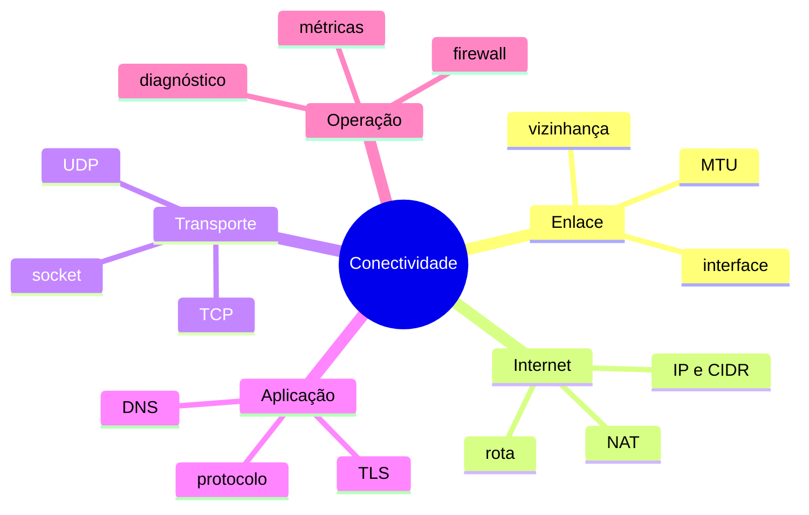

# Resumo

Uma comunicação depende de contratos encadeados. DNS encontra candidatos; roteamento escolhe caminho; enlace alcança o próximo salto; transporte conecta processos; aplicação interpreta mensagens e segurança valida identidades.

## Regras essenciais

1. Delimite origem, destino, porta, protocolo, horário e sintoma.
2. Não confunda resolução de nome com conexão ao serviço.
3. Interprete a rota efetivamente escolhida, não apenas a rota padrão.
4. Diferencie listener local de exposição por interface.
5. Considere IPv4 e IPv6, ida e retorno, estado e MTU.
6. Teste o protocolo da aplicação, não apenas ICMP ou TCP.
7. Colete métricas em intervalo e preserve uma linha do tempo.
8. Aplique menor exposição, criptografia e autorização.

> [!note]
> Ferramentas como `ip`, `ss`, `dig`, `nft` e `tcpdump` respondem perguntas diferentes. Escolha a ferramenta depois de formular a hipótese.

Revise em [[12-Perguntas-de-Entrevista]] e [[13-Exercicios]].
