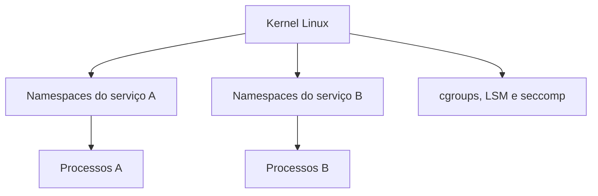

# Introdução

Empacotar aplicação e dependências reduz divergências entre ambientes, mas não elimina dependências do kernel, arquitetura, configuração, dados e serviços externos. O contêiner padroniza o artefato e parte da execução; operação confiável ainda exige contratos.

## Contêiner e máquina virtual

| Aspecto | Contêiner | Máquina virtual |
| --- | --- | --- |
| kernel | compartilhado com o host | kernel convidado próprio |
| isolamento | primitivas do kernel | hipervisor e hardware virtual |
| inicialização | processo | sistema operacional |
| densidade | geralmente maior | geralmente menor |
| fronteira | configurável e compartilhada | mais forte por padrão |

## Propriedades desejadas

Uma carga deve ter imagem identificada por digest, configuração externa, filesystem mínimo, usuário não root, limites, health checks, logs em streams, sinais tratados e dados persistentes fora da camada efêmera.

> [!warning]
> Isolamento não equivale a segurança absoluta. Todos os contêineres do host confiam na mesma superfície de kernel, salvo camadas adicionais como VMs ou sandboxes.

Comece por [[03-Processos-Namespaces-e-Isolamento]].
