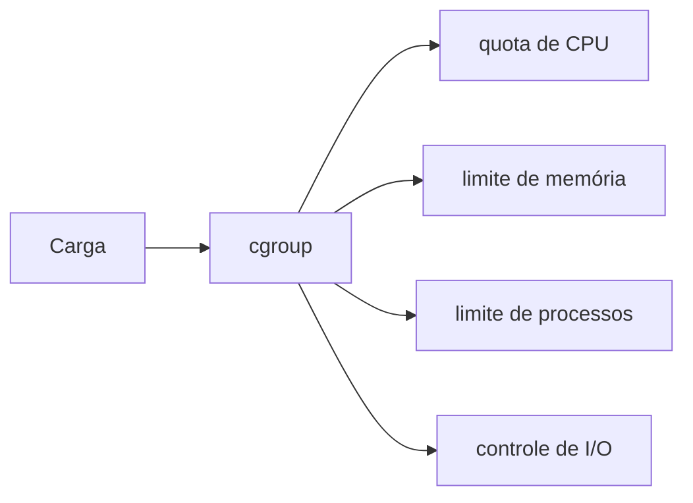

# Cgroups, Recursos e Qualidade de Serviço

Namespaces controlam visibilidade; cgroups controlam e contabilizam consumo. No cgroup v2, controladores compartilham hierarquia unificada e expõem arquivos de configuração e métricas.

## Recursos

```bash
cat /proc/self/cgroup
cat /sys/fs/cgroup/memory.current
cat /sys/fs/cgroup/memory.max
cat /sys/fs/cgroup/cpu.stat
```

| Recurso | Controle | Risco sem limite |
| --- | --- | --- |
| memória | `memory.max`, `memory.high` | OOM do host |
| CPU | `cpu.max`, `cpu.weight` | latência e fome |
| PIDs | `pids.max` | fork bomb, indisponibilidade |
| I/O | `io.max`, `io.weight` | saturação compartilhada |

Memória “usada” inclui categorias como cache e anônima. Ao atingir limite rígido, o kernel pode executar OOM kill no cgroup. CPU limitada sofre throttling, não falha imediatamente; a aplicação aparece lenta.



## Requests e limits

Orquestradores podem usar solicitações para posicionamento e limites para contenção. Dimensione com percentis, picos, heap, cache, buffers nativos e comportamento de GC. Limite muito baixo converte variação normal em reinícios.

> [!warning]
> Métricas do host e do contêiner têm denominadores diferentes. Defina explicitamente se CPU representa núcleo, quota ou capacidade do nó.

Próximo: [[05-Imagens-OCI-Camadas-e-Root-Filesystem]].
