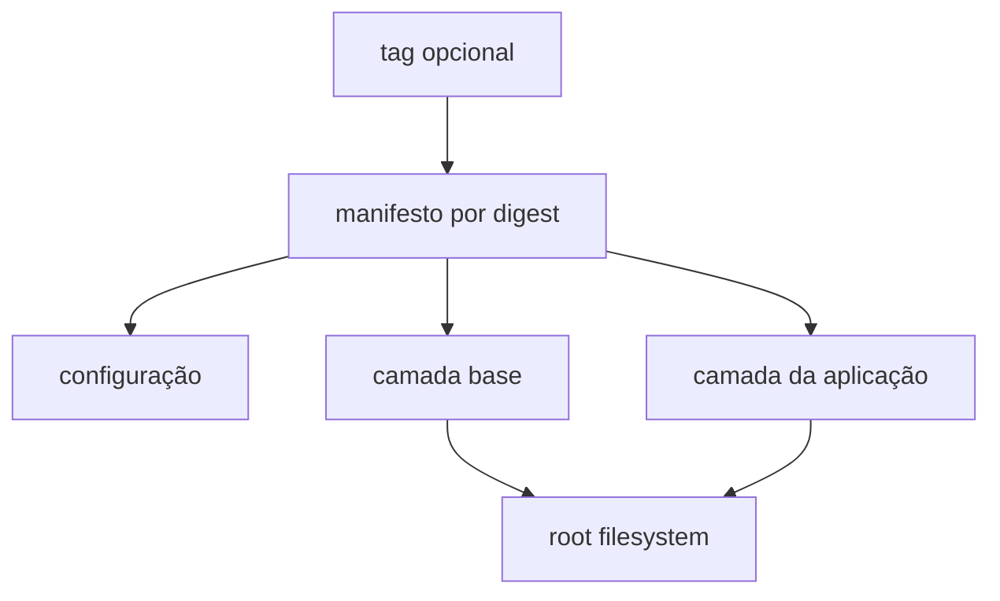

# Imagens OCI, Camadas e Root Filesystem

Uma imagem OCI é um conjunto de blobs endereçados por digest. Um manifesto referencia configuração e camadas; um índice pode selecionar variantes por arquitetura e sistema operacional. Tag é ponteiro mutável, digest identifica conteúdo.



Camadas são arquivos tar aplicados em ordem. *Whiteouts* representam remoções. Um driver como overlayfs combina camadas inferiores somente leitura com camada superior gravável do contêiner.

```bash
docker image inspect --format '{{json .RepoDigests}}' exemplo:1.0
docker history --no-trunc exemplo:1.0
```

## Builds reproduzíveis

- fixe imagem base por digest quando o processo exigir imutabilidade;
- use contexto mínimo e `.dockerignore`;
- ordene dependências e normalize timestamps quando possível;
- separe etapa de build da imagem de runtime;
- não inclua credenciais em `ARG`, camada ou histórico;
- gere SBOM, assinatura e proveniência verificáveis.

Imagens pequenas reduzem transferência e superfície, mas “distroless” exige estratégia específica de debug. Nunca extraia tar não confiável sem impedir caminhos absolutos, `..`, links e dispositivos.

> [!note]
> Apagar um segredo em camada posterior não o remove da camada anterior. Revogue o segredo e reconstrua o histórico seguro.

Continue em [[06-Runtimes-Ciclo-de-Vida-e-Estado]].
