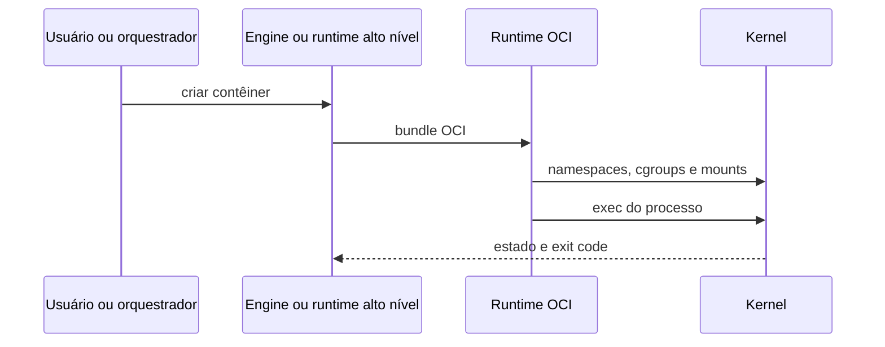

# Runtimes, Ciclo de Vida e Estado

Uma engine gerencia imagens, rede, volumes e experiência do usuário. Um runtime de alto nível mantém ciclo de vida; um runtime OCI de baixo nível configura namespaces, cgroups, mounts, capabilities e executa o processo descrito no bundle.



O contêiner permanece ativo enquanto seu processo principal vive. `exec` inicia processo adicional no mesmo contexto; não cria novo contêiner. Pausar normalmente congela tarefas; parar envia sinal e aguarda período de graça; matar encerra sem cooperação.

## Contrato do processo

```dockerfile
ENTRYPOINT ["/app/worker"]
CMD ["--config", "/etc/dataretail/config.yaml"]
```

A forma JSON evita shell intermediário e melhora sinais. A aplicação deve escrever logs em stdout/stderr, tratar `SIGTERM`, parar de aceitar trabalho, concluir ou devolver tarefas e sair com status significativo.

Health checks têm papéis distintos: *startup* protege inicialização lenta, *readiness* controla tráfego e *liveness* detecta travamento recuperável. Reiniciar não corrige dependência indisponível e pode criar tempestade.

> [!tip]
> Registre motivo de término, status, OOM, reinícios e duração; “Exited” descreve estado, não causa.

Próximo: [[07-Armazenamento-Volumes-e-Persistencia]].
