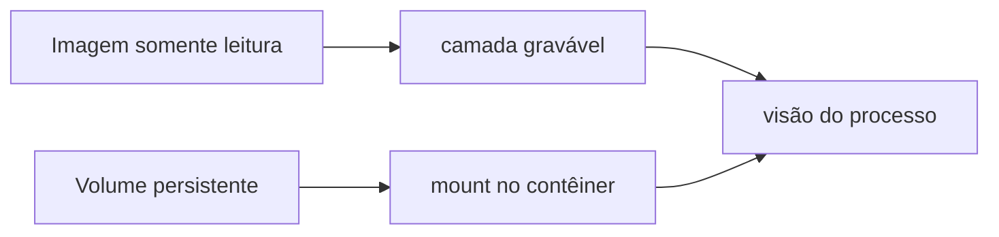

# Armazenamento, Volumes e Persistência

A camada gravável do contêiner acompanha sua instância e pode usar copy-on-write. Ela é adequada a temporários e cache descartável, não a dados cujo ciclo de vida supera o processo.

| Opção | Característica | Uso típico |
| --- | --- | --- |
| camada gravável | efêmera e ligada à instância | temporários |
| bind mount | caminho explícito do host | desenvolvimento e integração |
| volume gerenciado | ciclo próprio da engine | dados locais persistentes |
| tmpfs | memória, não persistente | segredos temporários e scratch |
| storage remoto | plugin ou driver | mobilidade e alta disponibilidade |

```bash
docker run --read-only --tmpfs /tmp:rw,noexec,nosuid,size=64m \
  --mount type=volume,src=pedidos,dst=/var/lib/pedidos imagem@sha256:...
```

## Consistência

Persistência não equivale a backup. Considere flush, atomicidade, locking, permissões, UID/GID, SELinux, capacidade, latência e recuperação. Bancos exigem semântica de filesystem compatível e procedimento consistente de snapshot ou backup lógico.

Mounts podem ocultar arquivos já presentes no caminho da imagem. Um bind mount também expõe parte do host e deve ser somente leitura quando escrita não é necessária.



> [!warning]
> Não monte o socket da engine em cargas comuns: ele frequentemente concede controle equivalente ao host.

Continue em [[08-Rede-de-Containers-e-Descoberta-de-Servicos]].
