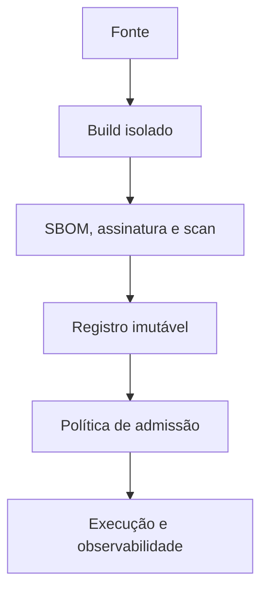

# Segurança, Supply Chain, Observabilidade e Operação

Segurança combina redução de superfície, identidade, política no kernel, integridade do artefato e resposta operacional. Nenhum controle isolado contém todos os riscos.

## Controles de execução

- usuário não root e user namespace quando viável;
- root filesystem somente leitura;
- remoção de capabilities, adicionando apenas as necessárias;
- `no-new-privileges`, seccomp e AppArmor ou SELinux;
- limites de CPU, memória, PIDs e I/O;
- mounts mínimos e segredos fora da imagem;
- rede restrita por origem, destino e porta;
- runtime e kernel atualizados.

```bash
docker run --read-only --cap-drop ALL --security-opt no-new-privileges \
  --pids-limit 128 --memory 512m --cpus 1.0 imagem@sha256:...
```

Capabilities dividem o poder tradicional de root. Seccomp limita syscalls; LSM aplica políticas de acesso; namespaces limitam visão; cgroups limitam recursos. São camadas complementares.

## Cadeia de suprimentos

Fixe fontes, verifique assinatura e proveniência, gere SBOM, analise vulnerabilidades com contexto e reconstrua imagens após correções. Um scanner encontra versões conhecidas; não prova explorabilidade nem ausência de falhas.

## Operação

Colete logs de streams com identificadores externos, métricas de aplicação e cgroup, eventos de runtime, traces e motivo de reinício. Defina SLO, janela de término, política de rollout, rollback por digest e runbook de debug.



> [!warning]
> `--privileged`, host PID, host network, dispositivos e mounts do host enfraquecem fronteiras. Exija justificativa, escopo e expiração.

Aplicação integrada: [[10-Estudo-de-Caso-DataRetail]].
