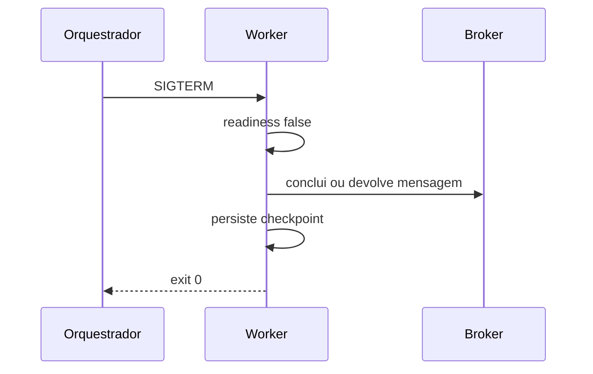

# Estudo de Caso — DataRetail S.A.

A DataRetail S.A. conteinerizou um worker de pedidos. A primeira versão executava como root, gravava checkpoints na camada efêmera, usava tag `latest`, não possuía limites e era encerrada durante mensagens em andamento.

## Redesenho

| Risco | Decisão |
| --- | --- |
| artefato variável | promoção pelo mesmo digest |
| privilégios amplos | usuário dedicado, capabilities removidas |
| perda de checkpoint | estado externo transacional |
| OOM do nó | request, limite e métrica de working set |
| trabalho interrompido | `SIGTERM`, readiness e período de graça |
| dependências abertas | egress somente para broker, banco e DNS |
| vulnerabilidade desconhecida | SBOM, assinatura, scan e rebuild |

## Critérios de aceite

- imagem reproduzível, assinada e referenciada por digest;
- processo não root e root filesystem somente leitura;
- segredos injetados em runtime e nunca logados;
- health checks distinguem inicialização, prontidão e vida;
- limites foram testados sob pico e OOM;
- rollout preserva compatibilidade de schema e mensagens;
- backup e recuperação do estado foram exercitados.

## Lição

O contêiner tornou a entrega repetível, mas a confiabilidade veio dos contratos de estado, recursos, sinais, identidade e observabilidade. O runtime não corrigiu automaticamente a semântica do worker.

Implemente o modelo de imagem em [[14-Laboratorio]].
