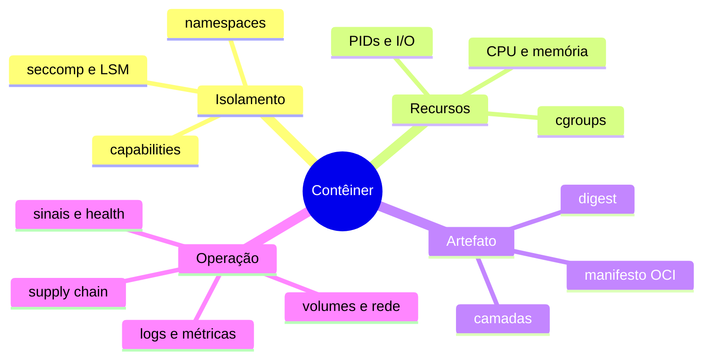

# Resumo

Contêiner é uma forma de executar processos com visão, recursos e privilégios controlados. A imagem fornece root filesystem e configuração; o runtime materializa o contrato usando o kernel.

## Regras essenciais

1. Trate contêiner como processo, não como host completo.
2. Use imagem imutável por digest e configuração externa.
3. Não grave estado importante na camada efêmera.
4. Execute sem root, remova capabilities e restrinja syscalls.
5. Defina limites com base em testes e métricas.
6. Trate sinais e dê tempo para encerramento gracioso.
7. Separe health de aplicação, prontidão e dependências.
8. Proteja build, registro, SBOM, assinatura e proveniência.

> [!note]
> Docker, Podman, containerd e CRI-O implementam experiências diferentes sobre fundamentos compartilhados. Aprender os mecanismos evita diagnóstico por tentativa.

Revise em [[12-Perguntas-de-Entrevista]] e [[13-Exercicios]].
