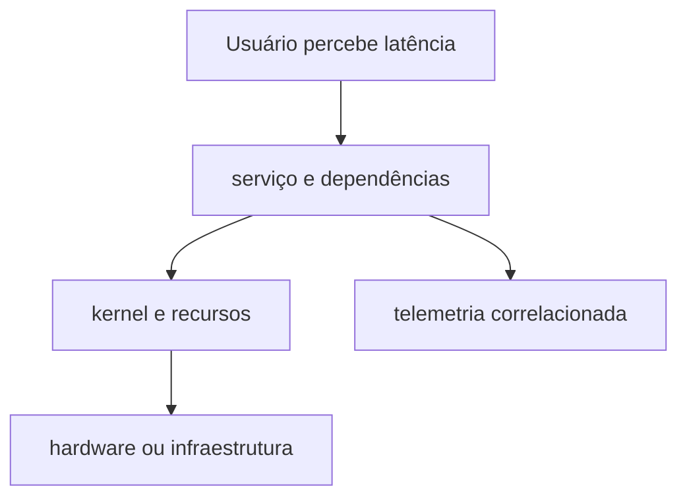

# Introdução

“O servidor está lento” não é um diagnóstico. É preciso definir operação, população afetada, janela, latência, taxa de erros, carga e expectativa. O mesmo uso de CPU pode ser saudável em um batch e crítico em uma API.

## Três disciplinas

| Disciplina | Pergunta |
| --- | --- |
| performance analysis | qual recurso ou caminho limita o objetivo? |
| troubleshooting | qual hipótese explica o desvio observado? |
| observabilidade | quais sinais permitem explicar o estado interno? |

Mude uma variável por vez, registre antes e depois, preserve relógios e compare com período saudável. Reiniciar pode restaurar serviço, mas também apagar estado necessário para descobrir a causa.

> [!warning]
> Correlação não prova causalidade. CPU alta durante lentidão pode ser causa, consequência ou trabalho útil.

Comece em [[03-Metodo-Baselines-USE-e-RED]].
