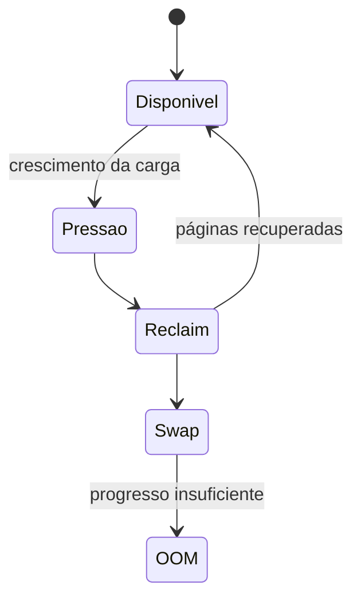

# Memória, Cache, Swap e OOM

Linux usa memória livre para page cache e a recupera sob demanda. Portanto, “free baixo” isolado não significa falta. `MemAvailable` estima quanto pode ser usado sem swap relevante, mas pressão e latência exigem métricas adicionais.

```bash
free -h
vmstat 1
cat /proc/meminfo
cat /proc/pressure/memory
```

## Categorias

- memória anônima: heap, stack e dados privados;
- page cache: páginas de arquivos;
- slab: estruturas do kernel;
- memória compartilhada e mapeada;
- swap: páginas movidas para armazenamento.

Page faults menores resolvem páginas sem leitura do disco; maiores podem exigir I/O. Reclaim contínuo, swap in/out, PSI elevado e OOM são sinais fortes de pressão.



O OOM killer escolhe vítimas conforme consumo, ajuste e contexto de cgroup. Consulte logs do kernel e `memory.events`. Vazamento é crescimento não liberado; cache crescente pode ser saudável.

> [!tip]
> Meça RSS, PSS, memória nativa, heap e cache conforme a linguagem. RSS somado pode contar páginas compartilhadas várias vezes.

Próximo: [[06-Armazenamento-I-O-e-Filesystems]].
